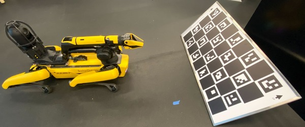
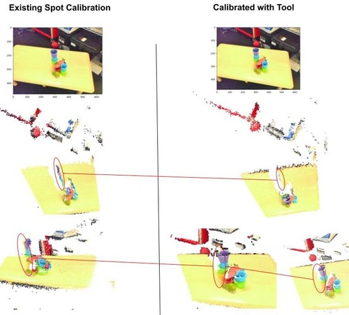

# Automatic Robotic Stereo Camera Calibration Utility with Charuco Target (a.k.a Multi-Stereo Madness)

## Find where your cameras are relative to each other, and relative to your robot
##  Find how your cameras project 3D points into pixels

### Recommended Setup



### Reference Image


# Table of Contents

1. [***Overview***](#overview)
2. [***Adapting Automatic Collection and Calibration to Your Scenario***](#adapting-automatic-data-collection-and-calibration-to-your-scenario)
3. [***Check if you have a Legacy Charuco Board***](#check-if-you-have-a-legacy-charuco-board)
4. [***Calibrate Spot Manipulator Eye-In-Hand Cameras With the CLI Tool***](#calibrate-spot-manipulator-eye-in-hand-cameras-with-the-cli-tool)
    - [Robot and Target Setup](#robot-and-target-setup)
    - [Example Usage](#example-usage-aka-hand-specific-live-incantations)
    - [Improving Calibration Quality](#improving-calibration-quality)
    - [Using the Registered Information with Spot ROS 2](#using-the-registered-information-with-spot-ros-2)
5. [***Using the CLI Tool To Calibrate On an Existing Dataset***](#using-the-cli-tool-to-calibrate-on-an-existing-dataset)
6. [***Understanding the Output Calibration Config File from the CLI***](#understanding-the-output-calibration-config-file-from-the-cli)
7. [Recreate the Core Calibration CLI Tool Without Depending On Spot Wrapper](#recreate-the-core-calibration-cli-tool-without-depending-on-spot-wrapper)

# Overview

This utility streamlines automatic
camera calibration to **solve for the intrinsic and extrinsic parameters for two or more 
cameras mounted in a fixed pose relative to each other on a robot**
based off of moving the robot to view a Charuco target from different poses. If you already 
have an existing dataset of synchronized stereo (or multi-stereo) photos of a Charuco target from different viewpoints, 
you can use the CLI tool to compute the intrinsic/extrinsic parameters. Additionally, if you have saved the poses the images are taken at (as homogenous 4x4 transforms from the "world" frame [most likely the robot base] to the robot planning frame [most likely the 
robot end-effector]), you can also calibrate
the camera to robot extrinsic (eye-to-hand registration). If you don't have a dataset,
you can use this tool both to generate the dataset and calibrate the cameras.

The CLI tool's saving capability allows to store multiple unique calibration runs in one configuration file
with calibration metadata, to document related runs with different setups or parameters.

This was developed to calibrate the two cameras at the 
end of Spot's optional manipulator payload, while being **as general as possible 
to be easily adapted to new robots and camera configurations. The core calibration utilities depend only on NumPy and OpenCV.**

This utility works by sampling viewpoints relative to the Charuco calibration board,
visiting those viewpoints, and snapping photos with all cameras at each viewpoint. Then,
these images are used to calibrate the desired cameras both individually and with respect to each
other. This utility is particularly good at handling partial views of the board
due to it's use of a charuco board. For more info, see ```calibration_util.py```, where the functions
```get_multiple_perspective_camera_calibration_dataset``` and ```multistereo_calibration_charuco```
do most of the heavy lifting.

# Adapting Automatic Data Collection and Calibration to Your Scenario

Assuming that you have a charuco board you'd like to automatically calibrate your cameras/robot with:

**To calibrate a new robot with new cameras using the utility**, implement the abstract class ```AutomaticCameraCalibrationRobot``` from ```automatic_camera_calibration_robot.py``` 
(Only five methods, that are likely analogous to what's needed for automatic calibration even if this utility isn't used.
in Spot's case , excluding comments, it's under ~250 lines of code, see ```spot_in_hand_camera_calibration.py```),
and pass the implemented class as an argument to ```get_multiple_perspective_camera_calibration_dataset``` from ```calibration_util.py``` (see ```calibrate_spot_hand_camera_cli.py``` for an example).

**Adding a new camera to register with Spot's existing hand cameras** is as easy as adding a call to append
the new camera image in ```SpotInHandCalibration.capture_images``` in ```spot_in_hand_camera_calibration.py``` to the existing
list of images obtained with the default cameras (assuming that the new camera
is fixed relative to the existing cameras.).

# Check if you have a Legacy Charuco Board

You only need to do this if using an opencv version after ```4.7```(
check with```python3 -c "import cv2; print(cv2.__version__)"```)

Through using the CLI tool (```python3 calibrate_multistereo_cameras_with_charuco_cli.py -h```), you can check if you have a legacy board through visually comparing the generated drawn virtual board to your physical charuco board target. Some legacy boards have an aruco tag in the top
left corner, whether as some non-legacy boards have a checker in the top left corner.
Also, check to see that the aruco tags match between virtual and physical boards.
It is important that the virtual board matches the physical board, otherwise this calibration
will not work.

```
python3 calibrate_multistereo_cameras_with_charuco_cli.py --check_board_pattern --legacy_charuco_pattern t 
```

There should be an axis at the center of the board, where the Y axis (green)
points upwards, the X axis (red) points to the right, and the figure should be labelled
as Z-axis out of board. If it isn't then try without legacy (```--legacy_charuco_pattern f```).

If you are using the default Spot Calibation board, and there is an aruco marker
in the top left corner, then it legacy (so supply true argument to legacy.)

# Calibrate Spot Manipulator Eye-In-Hand Cameras With the CLI tool

There is an [existing method to calibrate the gripper cameras with the Spot Api](https://dev.bostondynamics.com/protos/bosdyn/api/proto_reference#bosdyn-api-spot-GripperCameraCalibrationCommandRequest). However, you don't have 
as much control and extensibility in the existing method as with this custom procedure.

In Spot's hand, there is an RGB camera, as well as a ToF camera, which ```calibrate_spot_hand_camera_cli.py``` 
automatically co-registers using the calibration utility via the default calibration board included
with most Spots. You can also use a different board if you'd like, just set the right CLI parameters
(see example usage below)

## Robot and Target Setup
Have Spot sit on the ground with the arm stowed such that nothing is within a meter of the robot.
Spot should NOT be on its charging dock.

No program should have robot control authority. Make sure Spot is sitting 
with the arm stowed before releasing robot authority.
If you are using the ROS 2 Driver, disconnect from Spot. If you are using the tablet to control Spot, 
select power icon (top) -> Advanced -> Release control.

Place the Spot default calibration board on the ground leaning against something in front of Spot, so
that the calibration board's pattern is facing Spot front (where the stowed arm points).
The up arrow should point in the direction of the sky. The board should be tilted away from
Spot at a 45 degree angle, so that the bottom of the board is closer Spot than the top of the board. The ground beneath
the board should be at about a 45 degree angle from the board. The board's bottom should be about a meter away 
from the front of Spot while sitting. Nothing should be within a meter of the robot.

**See the first reference image at the top of this README to see good board placement relative to Spot.**

When calibrating, Spot will stand up, ready its arm, lower its base slightly, and 
lower its arm slightly. As soon as this happens, if Spot
can see a Charuco board it will start to move the arm around for the calibration. 

If the calibration board isn't placed at the right location, or there is more
than one board visible to the robot, this may lead to potentially unsafe behavior, so be ready to
E-Stop the robot at any moment. If the robot starts exhibiting unexpected behavior, stopping the program, 
turning off the computer running the calibration, and hijacking control from the tablet can help stop robot movement.

It is possible to calibrate at further distances 
(see ```--dist_from_board_viewpoint_range``` arg), but the sampling of the viewpoint
distance from the board must be feasible to reach with where the base of the 
robot is started relative to the board. The previously recommended Spot and Target setup is what worked well 
in testing for the default distance viewpoint range.

After the calibration is finished, Spot stows its arm and sits back down. At this point,
it is safe to take control of Spot from the tablet or ROS 2 , even if the calibration script is still
running. Just don't stop the script or it will stop calculating the parameters :) 

If Spot is shaking while moving the arm around, it is likely that
your viewpoint range is too close or too far (most often, adjusting
```--dist_from_board_viewpoint_range``` will help with that). You can
also try to drive the Spot to a better location to start the calibration
that fits the distance from viewpoint range better.

## Example Usage (a.k.a Hand Specific Live Incantations)
For all possible arguments to the Hand Specific CLI tool, run ```python3 calibrate_spot_hand_camera_cli.py -h```.
Many parameters are customizable.

If you'd like to calibrate depth to rgb, with rgb at default resolution, saving photos to ```~/my_collection/calibrated.yaml```, 
here is an example CLI command template, under the default tag (recommended for first time).
Note that the default Spot Board is a legacy pattern for OpenCV > 4.7, so ensure to pass
the --legacy_charuco_pattern flag 
```
python3 calibrate_spot_hand_camera_cli.py --ip <IP> -u user -pw <SECRET> --data_path ~/my_collection/ \
--save_data --result_path ~/my_collection/calibrated.yaml --photo_utilization_ratio 1 --stereo_pairs "[(1,0)]" --legacy_charuco_pattern True \
--spot_rgb_photo_width=640 --spot_rgb_photo_height=480 --tag default
```
If you'd like to load photos, and run the calibration with slightly different parameters, 
while saving both the resuls and the parameters to same the config file as in the previous example.
Here is an example CLI command template (from recorded images, no data collection)
```
python3 calibrate_multistereo_cameras_with_charuco_cli.py --data_path ~/my_collection/ 
--result_path ~/my_collection/bottle_calibrated.yaml --photo_utilization_ratio 2 --stereo_pairs "[(1,0)]" --legacy_charuco_pattern True \
--spot_rgb_photo_width=640 --spot_rgb_photo_height=480 --tag less_photos_used_test_v1
```
If you'd like to calibrate depth to rgb, at a greater resolution, while sampling
viewpoints at finer X-rotation steps relative to the board, and slightly further from the board
with finer steps, here is an example CLI command template. Also,
to demonstrate the stereo pairs argument, let's assume that you also want to find rgb to depth (redundant for 
demonstration purposes), while writing to the same config files as above.
```
python3 calibrate_spot_hand_camera_cli.py --ip <IP> -u user -pw <SECRET> --data_path ~/my_collection/ \
--save_data --result_path ~/my_collection/calibrated.yaml --photo_utilization_ratio 1 --stereo_pairs "[(1,0), (0,1)]" --legacy_charuco_pattern True\
--spot_rgb_photo_width=1920 --spot_rgb_photo_height=1080 --x_axis_rot_viewpoint_range -10 10 1 \
--dist_from_board_viewpoint_range .6 .9 .1
```

## Improving Calibration Quality
If you find that the calibration quality isn't high enough, try a longer calibration
with a wider variety of viewpoints (decrease the step size, increase the bounds). 
The default calibration viewpoint parameters are meant to facilitate a quick calibration
even on more inexpensive hardware, and as such uses a minimal amount of viewpoints. 

However, in calibration, less is more. It is better to collect fewer high quality
viewpoints then many low quality ones. Play with the viewpoint sampling parameters
to find what takes the most diverse high quality photos of the board.

Also, [make you are checking if your board is legacy, and if you can 
allow default corner ordering](#check-if-you-have-a-legacy-charuco-board).

If you are using a robot to collect your dataset, such as Spot, you can
also try increasing the settle time prior to taking an image (see ```--settle_time```)

## Using the Registered Information with Spot ROS 2
If you have the [Spot ROS 2 Driver](https://github.com/bdaiinstitute/spot_ros2) installed,
you can leverage the output of the automatic calibration to publish a depth image registered
to the RGB image frame. For more info, see the ```Optional Automatic Eye-in-Hand Stereo Calibration Routine for Manipulator (Arm) Payload```
section in the [spot_ros2 main README](https://github.com/bdaiinstitute/spot_ros2?tab=readme-ov-file#optional-automatic-eye-in-hand-stereo-calibration-routine-for-manipulator-arm-payload)
# Using the CLI Tool To Calibrate On an Existing Dataset
To use the CLI Tool, please ensure that you have one parent folder, 
where each camera has a folder under the parent (Numbered from 0 to N). Synchronized photos 
for each camera should appear in their respective directories, where matching photos have ids, ascending
upwards, starting from 0. The file structure should appear something like the following:
```
existing_dataset/
├── 0/
│   ├── 0.png # taken at viewpoint 0 
│   ├── 1.png
│   └── 2.png
├── 1/
│   ├── 0.png # taken at viewpoint 0
│   ├── 1.png
│   └── 2.png
├── 2/
│   ├── 0.png # taken at viewpoint 0
│   ├── 1.png
│   └── 2.png
├── poses/ # optional, for camera to robot cal
│   ├── 0.npy # base to planning frame 4x4 homgenous transform at viewpoint 0
│   ├── 1.npy # .npy files generated with np.save(FILENAME, 4x4_POSE)
│   └── 2.npy
```

Optionally, you can also include pose information, to find the camera to robot extrinsic.


To see all possible arguments for calibration, please run  ```python3 calibrate_multistereo_cameras_with_charuco_cli.py -h```.
    Many parameters such as board proportions and Agmruco dictionary are customizable.

If you'd like to register camera 1 to camera 0, and camera 2 to camera 0, you could do the following:
```
python3 calibrate_multistereo_cameras_with_charuco_cli.py --data_path ~/existing_dataset/ \
--result_path ~/existing_dataset/eye_in_hand_calib.yaml --photo_utilization_ratio 1 --stereo_pairs "[(1,0), (2, 0)]" \
--legacy_charuco_pattern=SUPPLY_CHECK_BOARD_FLAG_TO_SEE_IF_LEGACY_NEEDED \
--tag default --unsafe_tag_save
```

# Understanding the Output Calibration Config File from the CLI

A calibration produced with ```multistereo_calibration_charuco``` from ```calibration_util```
can be saved as a ```.yaml```file with ```save_calibration_parameters``` from ```calibration_util```. 
Here is a demonstration output calibration config file for example purposes:

```
default:
  intrinsic:
    1: 
      camera_matrix: flattened_3x3_camera_matrix_now_9x1
      dist_coeffs: flat_5x1_opencv_distortion_coeffs
      image_dim: [height, width]
    0:
      camera_matrix: flattened_3x3_camera_matrix_now_9x1
      dist_coeffs: flat_5x1_opencv_distortion_coeffs
      image_dim: [480, 640]
  extrinsic:
    1: # primary camera index (origin/base frame), first sublevel
      0:  # reference camera index, second sublevel
        R: flattened_3x3_rotation_matrix_from_primary_to_reference_camera_now_9x1
        T: 3x1_translation_matrix_from_primary_to_reference_camera
      planning_frame: # the planning frame (in Spot's case, the hand)
       R: flattened_3x3_rotation_matrix_from_primary_to_robot_planning_frame_now_9x1
       T: 3x1_translation_matrix_from_primary_to_robot_planning_frame
  run_param:
    num_images: 729
    timestamp: '2024-08-19 03:43:06'
    stereo_pairs:
    - [1, 0]
    photo_utilization_ratio: 2
    num_checkers_width: 9
    num_checkers_height: 4
    dict_size: DICT_4X4_50
    checker_dim: 0.115
    marker_dim: 0.09
```

Each calibration run
that creates or modifies a config file is tagged with a unique name, to allow for tracking of several experiments, 
which is the main title (in the above case, ```default```).
Under the main title, there are the fields relevant to the calibration.
Under ```intrinsic```, the intrinsic (camera matrix, distortion coefficents, and image height/width)
for each camera are recorded as a flattened representation
under the camera's index number as it appears in the list of images 
returned by ```capture_images```. For example, if ```capture_images``` produces a list that is 
```[image_by_primary_camera, image_by_reference_camera]```, then the intrinsic for the ```primary_camera```
would be stored under ```0```, and the intrinsic for ```reference_camera``` would be stored under ```1```.

Under ```extrinsic```, the first sublevel, again a camera index, corresponds to the camera index of which camera
is the origin for the ```extrinsic``` transform between two cameras as the first
field in a requested stereo pair. The second sublevel corresponds to the index of which camera
the ```extrinsic``` maps to from the origin camera. See the comments in the example config file
above for more information. 
Additionally, arguments from an argparser can also be dumped into the yaml, which will be saved 
under ```run_param``` (excluding args that are: ```password``` or ```username```)

# Recreate the Core Calibration CLI Tool Without Depending On Spot Wrapper
If you like the core tools of this utility, and you'd like a more portable version (```standalone_cli.py```) for 
use independent of Spot that doesn't depend on Spot Wrapper, you could recreate
the CLI tool with no dependency on Spot Wrapper with the following command:
```
cat calibration_util.py <(tail -n +3 automatic_camera_calibration_robot.py) <(tail -n +26 calibrate_multistereo_cameras_with_charuco_cli.py) > standalone_cli.py
```
The core capability above depends primarily on NumPy, OpenCV and standard Python libraries.

# Contributors
Gary Lvov

# Special Thanks To...
Michael Pickett, Katie Hughes, Tiffany Cappellari, Andrew Messing, 
Emmanuel Panov, Eric Rosen, Brian Okorn, Joseph St Germain and Ken Baker.
